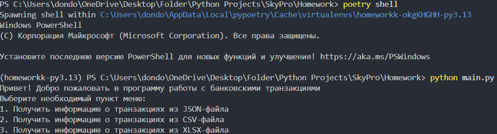
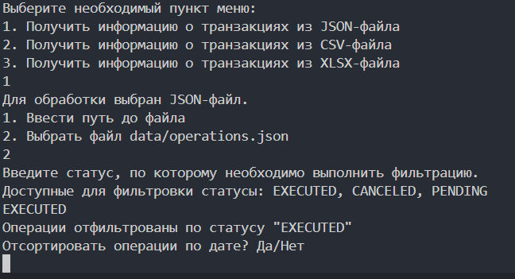
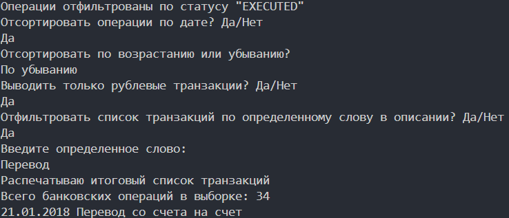

# Описание проекта

Проект позволяет фильтровать, сортировать а также отслеживать банковские операции клиента

# Структура проекта

- src/ папка с основным кодом проекта
- tests/ папка для создания тестов проекта
- data/ папка с исходными данными
  main.py главый файл проекта

# Установка

1. Клонируйте репозиторий

```
git clone https://github.com/pallantimos/Homework.git
```

2. Установите зависимости

```
poetry install
```

# Использование

1. Активируйте окружение poetry командой poetry shell
2. Запустите файл main.py командой python main.py
3. Следуйте инструкциям в терминале

# Пример использования

Пример использования main.py







# Тестирование

Протестированы модули в директории src
